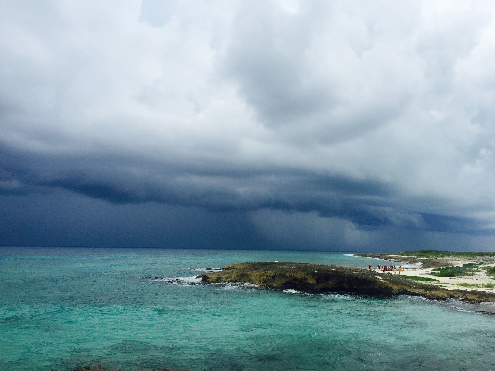

--- 
title: "2nd Marine Biodiversity Workshop: from the Sea to the Cloud"
#place: "Puerto Morelos, Mexico" 
date: "April 1-5, 2019"
site: bookdown::bookdown_site
output: bookdown::gitbook
documentclass: book
bibliography: [style/zotero_mbon-p2p.bib, style/packages.bib]
biblio-style: apalike
link-citations: yes
github-repo: marinebon/p2p-mexico-workshop
description: "This is a minimal example of using the bookdown package to write a book. The output format for this example is bookdown::gitbook."
---

```{r include=FALSE, eval=F}
# automatically create a bib database for R packages
knitr::write_bib(c(
  .packages(), 'bookdown', 'knitr', 'rmarkdown'
), 'style/packages.bib')
```

```{r setup, include=FALSE}
library(tidyverse)
library(knitr)
library(kableExtra)
library(leaflet)
library(sf)
opts_chunk$set(echo = F)
```

Pole-to-Pole [MBON](marinebon.org) & [AmeriGEOSS](https://www.amerigeoss.org) <br>
Location: Playa del Secreto, Puerto Morelos, Mexico <br>
Dates: April 1-5, 2019

# Overview

## Report from the previous workshop 

- [P2P MBON Workshop Report **Folder** - google drive](https://drive.google.com/file/d/1XOC1hcg8GRwNxDcfNav4p7bKX7QYVVNb/view?usp=sharing)


```{r, eval=F}
library(tidyverse)
library(knitr)
library(kableExtra)

options(knitr.kable.NA = '')
agenda <- readxl::read_excel("data/agenda.xlsx") %>%
  select(Time, Description)

# detect within-row headers by rows in first column Time that begin with "Aug "
i_groups         <- which(str_detect(agenda$Time, "^Aug "))
agenda_nongroups <- slice(agenda, -i_groups)
agenda_groups    <- slice(agenda, i_groups) %>% .$Time
i_group_rows     <- diff(c(i_groups, nrow(agenda))) - 1
groups_i         <- setNames(i_group_rows, agenda_groups)

if (is_latex_output()){
  kable(agenda_nongroups, "latex") %>%
    group_rows(index = groups_i) %>%
    column_spec(1, width = "0.5in")
} else {
  kable(agenda_nongroups, "html") %>%
    kable_styling("striped", full_width = T, font_size = 11) %>%
    group_rows(index = groups_i)
}
```

## Objectives

This second workshop builds up on activities and achieved goals from a first meeting in Sao Sebastiao, Brazil, in August this year. The purpose is to continue the development of a community of practice dedicated to understanding change in marine biodiversity and developing conservation and management strategies of marine living resources by engaging researchers, managers and policy-makers with interest in biodiversity monitoring and data synthesis and analysis. During this workshop participants will:

1. Advance already agreed field sampling protocols for rocky shores and sandy beaches;
1. Manipulate tabular and spatial data already collected at their study sites for standardized data formats using Darwin Core vocabularies and quality controls;
1. Develop specific vocabularies for the rocky shore and sandy beach sampling;
1. Publish these datasets to Ocean Biogeographic Information System (OBIS) using tools for sharing data;
1. Advance knowledge on data science tools (R, Rmarkdown, Github) to mine data, visualize and analysis, and produce reproducible research documents with interactive visualizations onto the web.


## Logistics

April 2-5, 2019 (+2 days for travel)

- Venue: 
Playa del Secreto, Puerto Morelos <br>
Unidad Académica de Sistemas Arrecifales ([UASA](https://www.icmyl.unam.mx/puerto_morelos/es/quienes-somos/la-unidad-academica)) <br>
Instituto de Ciencias del Mar y Limnología (ICML) <br>
Universidad Nacional Autónoma de México (UNAM) <br>
Puerto Morelo <br> 
Quintana Roo, Mexico

```{r}
pts <- tribble(
        ~lon,       ~lat,       ~name,    ~icon,   ~color,          ~description,                                ~comment,
  -86.8736, 21.040300, "Cancun",  "plane",  "green",   "Cancun International Airport",                                      NA,
  -86.945114, 20.775402,      "Playa del Secreto", "home", "orange", "Puerto Morelos", "venue for the MBON Pole to Pole workshop",
  -86.867217, 20.868086,   "UASA",   "home",    "red",       "São Sebastião", "host institution for the P2P workshop") %>%
  st_as_sf(coords = c("lon", "lat"), crs = 4326)

ctr <- pts$geometry %>% st_geometrycollection() %>% st_centroid() %>% st_coordinates()

icons <- awesomeIcons(
  icon = pts$icon,
  iconColor = 'black',
  library = 'fa',
  markerColor = pts$color)

leaflet(pts, options = leafletOptions(attributionControl=F)) %>%
  #addProviderTiles(provider = providers$Stamen.TonerLite) %>%
  addProviderTiles(provider = providers$Esri.NatGeoWorldMap, options = tileOptions(opacity=0.5)) %>%
  addAwesomeMarkers(icon = icons, label= ~name, labelOptions = labelOptions(noHide = T)) %>%
  setView(ctr[,"X"], ctr[,"Y"], zoom=9)
```


## Organizers

-	Marine Biodiversity Observation Network (MBON) Pole to Pole of the Americas - MBON Pole to Pole
-	Instituto de Ciencias Marinas y Limnológicas, Universidad Nacional Autónoma de México (ICML - UNAM)
-	AmeriGEOSS - Group on Earth Observations
-	Ocean Biogeographic Information System (OBIS)

## Workshop rationale

The **MBON Pole to Pole** is organizing a second Marine Biodiversity Workshop - From the Sea to the Cloud - after a successful first workshop held during the 2018 AmeriGEOSS Week in Brazil. This activity advances the implementation of the MBON Pole to Pole network by enhancing knowledge on field data collection methods and use of informatic technologies for data management and analysis. 

The MBON Pole to Pole aims to address the biodiversity priorities of various GEO initiatives, including Blue Planet and AmeriGEOSS, and coordinates with the Global Ocean Observing System (GOOS) of the Intergovernmental Oceanographic Commission of UNESCO and OBIS, and other national and international groups to serve the broadest possible community. This network will help nations and regions to improve conservation planning and environmental impact mitigation, serve the scientific community, and satisfy commitments to the Intergovernmental Science-Policy Platform on Biodiversity and Ecosystem Services (IPBES), Aichi Targets of the Convention of Biological Diversity (CBD), and the UN 2030 Agenda for Sustainable Development Goals (SDG’s).

The MBON Pole to Pole workshops:

- enhance coordination of data collection among nations;
- improve the collection of harmonized data, developing data standards and methodologies for data management and dissemination without compromising national concerns;
- support the integration of biodiversity information with physical and chemical data over time (status and trends); and
- generates products needed for informed management of the ocean.

The workshop targets investigators and resource managers dedicated to studying and conserving biodiversity of invertebrates in two important coastal habitats: rocky shore intertidal zone and sandy beaches. This activity targets participants from all nations in the Americas, from pole to pole.

## Instructors
- Enrique Montes (USF) - Project lead and workshop coordinator
- Eduardo Klein (OBIS) - Darwin Core (DwC), WoRMS species catalog for taxonomic quality control, and OBIS tools
- Ben Best (Ecoquants) - Data wrangling, visualization and analysis with R software, collaborative research platforms (Github, Git, RMarkdown) 
- Patricia Miloslavich (GOOS) - Protocols of the South American Research Group on Coastal Ecosystems (SARCE) and Essential Ocean/Biodiversity Variables (EOV/EBV) framework
- Frank Muller-Karger (USF) - Satellite remote sensing
- Sergio Cerdeira (CONABIO) - Sistema de Información y Análisis de Ecosistemas Marinos de México ([SIMAR](https://simar.conabio.gob.mx/))
- Maria Kavanaugh (OSU) - Satellite biogeography (seascape maps)
- Maikon di Domenico (Universidade Federal do Paraná) - sandy beaches*
- Gil Rilov (Israel Oceanographic and Limnological Research) -  Ecology of the rocky shore intertidal zone*
- Brian Helmuth (Northeastern University, USA) - Drivers of biodiversity variability and change in the rocky shore intertidal zone*
- Fernando Lima (University of Porto) - Technological approaches for understanding environmental variability in rocky shores*

## Required workshop materials

- Participants must bring a laptop computer with the following programes installed (with latest version, as of 2018-03-20):
    - [R](https://cran.r-project.org) (3.4.4)
    - [RStudio](https://www.rstudio.com/products/rstudio/download/#download) (1.1.442)
    - [Git](https://git-scm.com/downloads) (2.16.2)
    
    These are available for Windows, Mac or Linux operating systems.

- Install additional packages by running the following line of code in your R terminal:

```r
source("https://raw.githubusercontent.com/marinebon/p2p-brazil-workshop/master/scripts/install-R-packages.R")
```

- [SARCE sampling protocols](http://sarce.cbm.usb.ve/for-scientists/)
  <!---The past experience could be replicated (and it will be desirable if we want to make comparison in time) see the SARCE site and it protocols. The SARCE data will be in OBIS after the next harvest. --->

- Full snorkeling gear



## Eligibility

The workshop will be limited to 30 participants. Selection of participants will be based on survey results and their ability and willingness to openly contribute and share data through OBIS, sustain a collaborative long-term monitoring program in their study area, share best practices and contribute to achieving the overall goals of the P2P network. Priority will be given to participants of the previous workshop that conducted biodiversity surveys at their study sites as agreed in the first workshop and that have submitted data sheets to the MBON Pole to Pole Github repository. Applicants willing to use and share their own data are also eligible if they provide specific information about the type of dataset, study site location, time of collection and employed methods.  

## Survey

In order to partcipate, you will need to complete survey below (be sure to scroll down within frame), or by visiting the survey directly at https://goo.gl/forms/AIQ9djKDfyfpKuaE3, before the survey deadline of **May 1st, 2018**.

<iframe src="https://docs.google.com/forms/d/e/1FAIpQLSc8kMPaCnFBPP4P3Hk5F6VbImektTDo9LNQZUUxuYUPxIlo_Q/viewform?embedded=true" width="760" height="800" frameborder="0" marginheight="0" marginwidth="0">Loading...</iframe>

## Confirmation

Candidates will receive notice of acceptance by December 27th, 2018. Selected participants must confirm attendance to the workshop by replying to the acceptance notification email before January 25, 2019.

The workshop will provide partial or full travel support to a selected number of participants. Priority for travel suppor will be given to participants that conducted biodiversity surveys before December 31, 2018.  

## Resources

- [Ocean Biogeographic Information System (OBIS) - Manual](http://www.iobis.org/manual/)
- [R for Data Science](http://r4ds.had.co.nz/)
- [Spatial Data Analysis and Modeling with R](http://rspatial.org)
- [Species Distribution Modeling with R](https://cran.r-project.org/web/packages/dismo/vignettes/sdm.pdf)


The project is supported by the National Aeronautics and Space Administration (NASA) grant 80NSSC18K0318, ” Laying the foundations of the Pole-to-Pole Marine Biodiversity Observation Network (MBON) of the Americas”, and co-sponsored by AmeriGEOSS.


